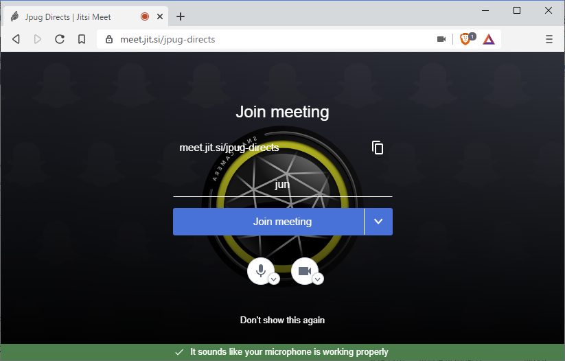
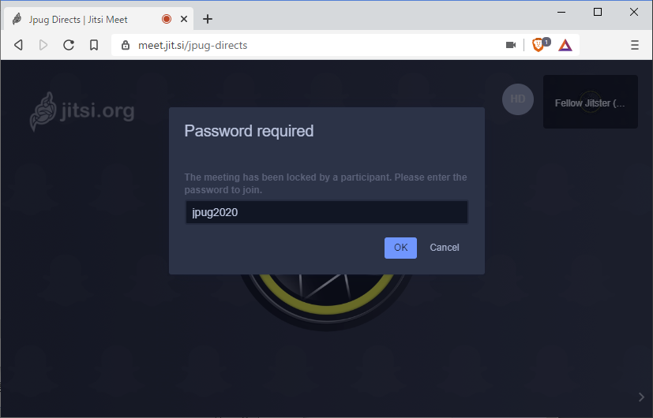
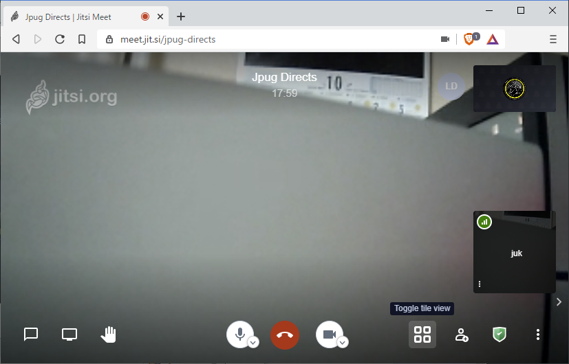
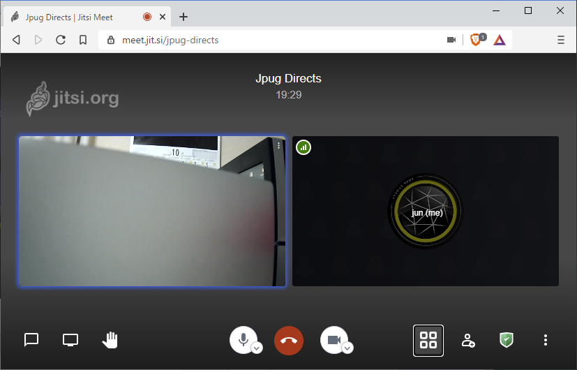

# jitsi meet の使い方

##  jitsi meet の会議室を開く

### [Jitsi Meet](https://meet.jit.si/) にアクセス

Jitsi MeetのURL: [https://meet.jit.si/](https://meet.jit.si/) をブラウザで開く。

### 会議室を開く

「 新しいミーティングを開始」に会議室名(例： jpug-directors) を入力し、[GO]をクリック

### カメラとマイクの使用を許可

カメラとマイクの使用許可を求めるダイアログが出るので、[許可する]をクリック

### 名前の入力

会議室での表示名（自分の名前）を入力し、[Join meeting] をクリック

### パスワード設定

右下のオレンジ色のホームベースのようなアイコン(Security Options)をクリックし、

"Security Options" ダイアログが現れるので、"Add パスワード" をクリックし、
適切にパスワード(ここでは、jpug/1008c0)を入力して "Add" をクリックする。

右上の [x] をクリックして閉じると、Security Optionsアイコンは緑色に変わる。

### 会議情報通知

[Invite more people] をクリックして、"meet.jit.si/jpug-directors" にカーソルを移動すると、"Copy meeting link" と表示されるので、クリックしてクリップボードにコピーするか、あるいは、[Share meeting invitation] からサービスを選択して、メッセージを清書して送信する。

※ 右下の「人の上半身+」のようなアイコンからもできます。

例えば、[Share meeting invitation] から[G](Google Email)をクリックすると次のようなメッセージが挿入される（ブラウザでGmailにログインしている場合）。

ダイアログは右上の [x] をクリックして閉じる。

### チャット

チャットは画面の左下にある。

顔マークも数えるほどある。

### 画面共有

チャットの右のディスプレイのようなアイコンは画面共有。メニューから共有したいウィンドウを選択し、「許可する」をクリックする。

一旦カメラが停止するので、下中央のカムアイコンをクリックして開始する。

共有の終了は、もう一度共有アイコンをクリックする。

## 参加の仕方

参加者は、指定されたURLにアクセスし（必要に応じてマイクとカメラの使用を許可）、
名前を入れて、"Join meeting" をクリックして参加

パスワードのプロンプトが出るので決められたパスワードを入力して[OK] をクリック

以上で、参加済。

右下の窓のようなアイコン(Toggle file view)をクリックしてタイル表示に切り替えられる。

